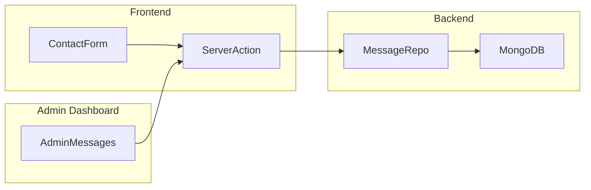

# Formulario de Contacto: Correcciones y Sistema de Mensajes

## Analisis de Issues Detectados

El formulario en [`ContactForm.tsx`](src/components/common/ContactForm.tsx) tiene varios problemas criticos:

1. **Sin handler de envio** -- el `<form>` no tiene `onSubmit`, asi que el submit hace un refresh de pagina sin enviar nada
2. **Campos no controlados** -- ningun input tiene `value` ni `onChange`, los datos del usuario nunca se capturan en estado
3. **Sin feedback al usuario** -- no hay estados de loading, exito o error
4. **No existe backend** -- no hay modelo, repositorio, validador, server action ni API route para mensajes
5. **Sin vista admin** -- los mensajes no se almacenan ni se pueden consultar en el dashboard

## Arquitectura Propuesta

Se sigue exactamente el patron existente del proyecto (Model -> Repository -> Validator -> Action -> Admin UI):

## Implementacion

### 1. Modelo Mongoose -- `Message`

Crear [`src/models/Message.ts`](src/models/Message.ts) con los campos:

| Campo | Tipo | Requerido |

|-------|------|-----------|

| name | string | si |

| email | string | si |

| whatsapp | string | no |

| subject | string | no |

| serviceId | ObjectId (ref Service) | no |

| message | string | si |

| isAttended | boolean (default false) | -- |

| isActive | boolean (default true) | -- |

| createdAt / updatedAt | timestamps | auto |

Exportar desde [`src/models/index.ts`](src/models/index.ts).

### 2. Validador Zod

Crear [`src/lib/validators/message.schema.ts`](src/lib/validators/message.schema.ts) con:

- `createMessageSchema` -- validacion del formulario (name, email requeridos, email valido, message requerido)
- `messageQuerySchema` -- filtros para la lista admin (isAttended, limit, offset)

Exportar desde [`src/lib/validators/index.ts`](src/lib/validators/index.ts).

### 3. Repository

Crear [`src/lib/repositories/message.repository.ts`](src/lib/repositories/message.repository.ts) extendiendo `BaseRepository`, con metodos:

- `findAllMessages(query)` -- listar con filtro de isAttended
- `createMessage(data)` -- crear mensaje
- `markAsAttended(id)` -- marcar como atendido
- `getUnreadCount()` -- count de no atendidos (para el dashboard)

Exportar desde [`src/lib/repositories/index.ts`](src/lib/repositories/index.ts).

### 4. Server Actions

Crear [`src/actions/message.actions.ts`](src/actions/message.actions.ts) con:

- `submitContactMessage(input)` -- llamada desde el formulario, valida con Zod y persiste
- `getMessages(query)` -- lista para el admin
- `markMessageAttended(id)` -- toggle atendido
- `getUnattendedCount()` -- para el stat del dashboard

Exportar desde [`src/actions/index.ts`](src/actions/index.ts).

### 5. Corregir ContactForm

En [`src/components/common/ContactForm.tsx`](src/components/common/ContactForm.tsx):

- Agregar estado controlado para todos los campos (`useState` o un solo state object)
- Agregar handler `onSubmit` que llame a `submitContactMessage`
- Agregar estados de `isSubmitting`, `success`, `error`
- Mostrar feedback visual (toast o mensaje inline)
- Limpiar el formulario tras envio exitoso

### 6. Admin: Pagina de Mensajes

Crear [`src/app/admin/messages/page.tsx`](src/app/admin/messages/page.tsx):

- Tabla con columnas: Nombre, Email, Servicio, Fecha, Estado (atendido/pendiente)
- Boton para marcar como "Atendido"
- Expandir/ver mensaje completo

### 7. Integrar en Admin Layout y Dashboard

- En [`src/app/admin/layout.tsx`](src/app/admin/layout.tsx): agregar link "Mensajes" en la navegacion del sidebar
- En [`src/app/admin/page.tsx`](src/app/admin/page.tsx): agregar stat card con conteo de mensajes no atendidos