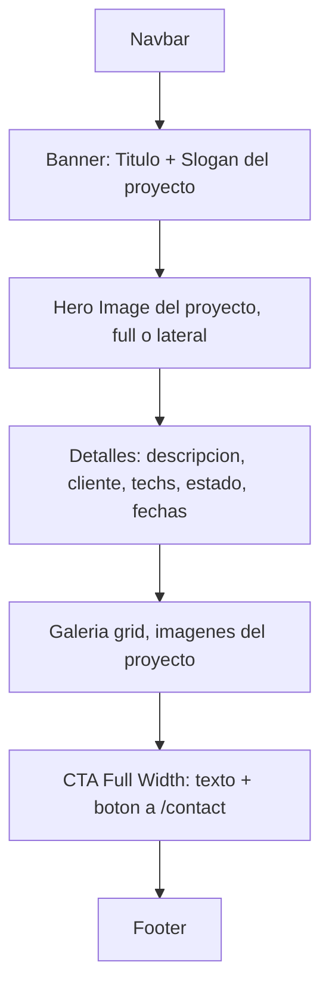
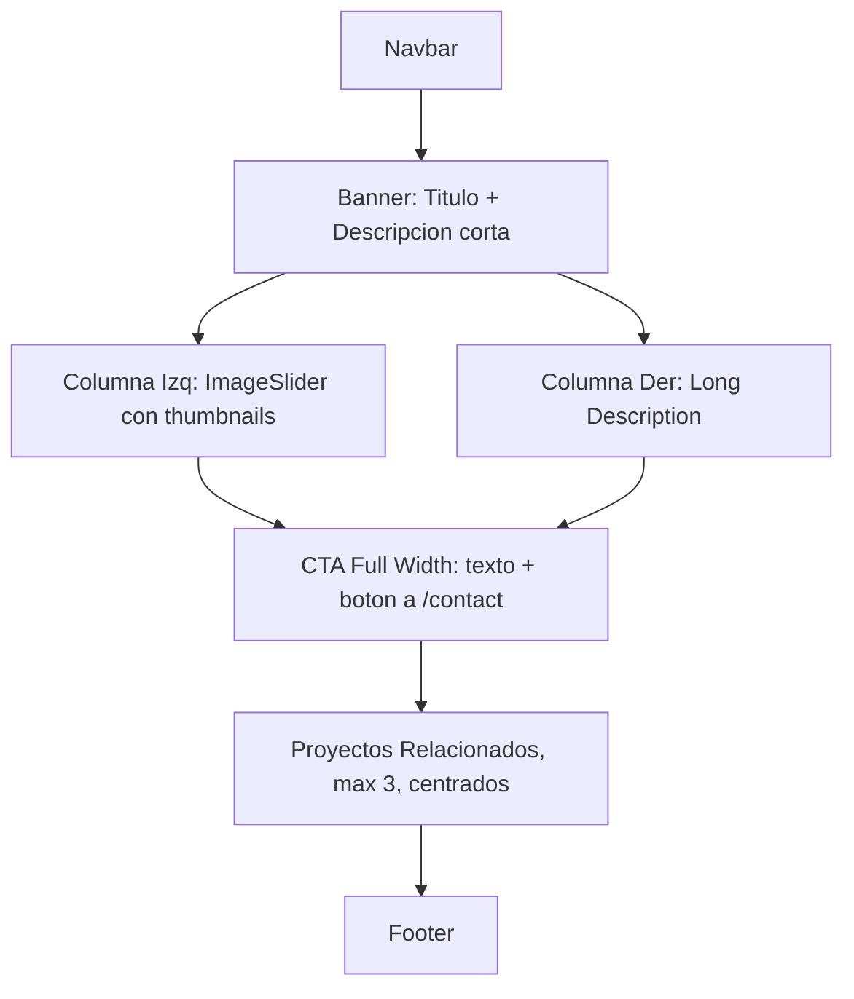

# Rediseño de páginas de detalle (servicio y proyecto)

## Resumen de cambios

Agregar el campo `slogan` a los modelos Service y Project, agregar `gallery: string[]` al modelo Service para soportar el slider de imagenes, crear componentes ImageSlider y CallToAction, rediseñar la pagina de detalle de servicio, y crear la pagina de detalle de proyecto con diseño diferenciado (sin carrusel).

---

## 1. Cambios en modelos de datos

### 1.1 Agregar `slogan` y `gallery` al modelo Service

En [`src/models/Service.ts`](src/models/Service.ts):

- Agregar `slogan?: string` a la interfaz `IService` (max 150 caracteres).
- Agregar `gallery: string[]` a la interfaz `IService` (array de URLs, default `[]`).
- Agregar ambos campos al schema de Mongoose.

### 1.2 Agregar `slogan` al modelo Project

En [`src/models/Project.ts`](src/models/Project.ts):

- Agregar `slogan?: string` a la interfaz `IProject` (max 150 caracteres).
- Agregar campo al schema de Mongoose.

### 1.3 Actualizar validadores Zod

- [`src/lib/validators/service.schema.ts`](src/lib/validators/service.schema.ts): agregar `slogan` (string, max 150, optional) y `gallery` (array de URLs, default `[]`) a `createServiceSchema`.
- [`src/lib/validators/project.schema.ts`](src/lib/validators/project.schema.ts): agregar `slogan` (string, max 150, optional) a `createProjectSchema`.

### 1.4 Actualizar tipos DTO

- [`src/types/project.ts`](src/types/project.ts): agregar `slogan?: string` a `ServiceDTO` y `ProjectDTO`. Agregar `gallery: string[]` a `ServiceDTO`.

---

## 2. Actualizar serialización y API

### 2.1 Server Actions

- [`src/actions/service.actions.ts`](src/actions/service.actions.ts): agregar `slogan` y `gallery` a la funcion `serializeService`.
- [`src/actions/project.actions.ts`](src/actions/project.actions.ts): agregar `slogan` a la serialización de proyectos.

### 2.2 API Routes

- [`src/app/api/services/route.ts`](src/app/api/services/route.ts): agregar `slogan` y `gallery` a la serialización en GET y POST.
- Verificar API de projects para incluir `slogan`.

---

## 3. Actualizar formularios de admin

- [`src/components/admin/ServiceForm.tsx`](src/components/admin/ServiceForm.tsx): agregar campo de texto para `slogan` y componente de upload multiple para `gallery`.
- [`src/components/admin/ProjectForm.tsx`](src/components/admin/ProjectForm.tsx): agregar campo de texto para `slogan`.

---

## 4. Actualizar tarjetas (miniaturas)

- [`src/components/common/ServiceCard.tsx`](src/components/common/ServiceCard.tsx): agregar prop `slogan` a la interfaz y mostrar el slogan debajo del titulo en la miniatura.
- [`src/components/common/ProjectCard.tsx`](src/components/common/ProjectCard.tsx): agregar prop `slogan` a la interfaz y mostrarlo debajo del titulo.

---

## 5. Crear componentes nuevos

### 5.1 ImageSlider

Crear `src/components/common/ImageSlider.tsx`:

- Componente client (`"use client"`).
- Recibe `images: string[]` y `alt: string`.
- Muestra una imagen principal grande.
- Debajo: botones miniatura (thumbnails) de cada imagen para seleccionar cual se ve.
- Sin flechas laterales de control.
- Transicion suave al cambiar de imagen.

### 5.2 CallToAction

Crear `src/components/common/CallToAction.tsx`:

- Componente reutilizable, ancho completo, forma rectangular.
- Props: `title: string`, `description?: string`, `buttonText: string`, `href: string`.
- Texto alineado a la izquierda, boton a la derecha.
- Redirección por defecto a `/contact`.

---

## 6. Rediseñar la página de detalle de servicio

Reestructurar [`src/app/services/[slug]/page.tsx`](src/app/services/[slug]/page.tsx) con la siguiente estructura:

```
Navbar (existente, fijo arriba)
|
Banner horizontal (titulo + descripcion corta)
|
Dos columnas:
  - Izquierda: ImageSlider (gallery del servicio, o image principal si no hay gallery)
  - Derecha: longDescription
|
CallToAction (full width, redirige a /contact)
|
Proyectos Relacionados (max 3, centrados)
|
Footer (existente)
```

### 6.1 Datos del servicio

Actualizar la funcion `getService()` para incluir `slogan` y `gallery`.

### 6.2 Limit opcional en proyectos por categoría

En [`src/lib/repositories/project.repository.ts`](src/lib/repositories/project.repository.ts), agregar parametro `limit?: number` **opcional** al metodo `findProjectsByCategory`. Cuando no se pasa, se devuelven todos. En la pagina de servicio se invoca con `limit: 3`. Las demas pantallas no se afectan.

---

## 7. Crear pagina de detalle de proyecto

Crear [`src/app/projects/[slug]/page.tsx`](src/app/projects/[slug]/page.tsx) (no existe actualmente).

Estructura similar a la de servicio pero con diferencias visuales:

- **Sin carrusel/slider** de imagenes. Se muestra la imagen principal del proyecto de forma destacada (hero o lateral grande).
- Banner con titulo + slogan (o description corta).
- Seccion de contenido: descripcion completa, cliente, tecnologias, estado, fechas.
- Galeria de imagenes del proyecto (ya existe `gallery: string[]` en el modelo Project) como grid de fotos, no como slider.
- CallToAction reutilizable (mismo componente, puede variar texto).
- Footer existente.
- Diferencias de diseño: paleta de acentos diferente (amber/dorado vs azul), layout asimetrico o con imagen hero a sangre completa, tipografia/espaciado distinto para que no se vean iguales.



---

## Estructura visual de servicio (segun wireframe)

